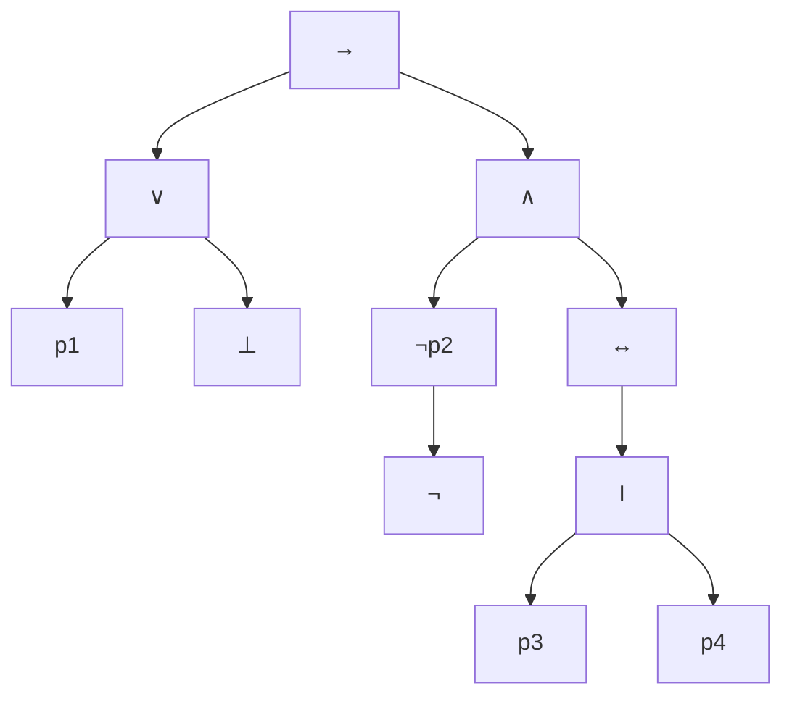

> ### Définition 1
> $$ \text{PROP} = \{ p1, p2, . . . , pn, . . . \} \text{ ensemble des symboles de propositions} $$
> $$ \text{connecteurs logique} \neg \land \lor \to \leftrightarrow \bot \top $$

---

> ### Définition 2
> $$ \text{ATOM} = \text{PROP} \cup \{ \bot, \top \} \text{ ensemble des formules atomiques} $$

---

> ### Définition 3
> FORM ensemble des formules, défini inductivement:
>  $$ \text{les formules atomiques sont des formules : } \text{ATOM} \subseteq \text{FORM} $$
> $$ \text{si } F \text{ est une formule alors } \neg F \text{ est une formule} $$
> $$ \text{Si } F1 \text{ et } F2 \text{ sont deux formules alors } F1 \land F2, F1 \to F2, F1 \lor F2 \text{ et } F1 \leftrightarrow F2 \text{ sont des formules} $$

Donc, Pour ces deux expression, nous avons : $$(p1 ∨ ⊥) → ((¬p2) ∧ (¬(p3 ↔ p4)))$$
$$p1 ∨ ⊥ → ¬p2 ∧ ¬(p3 ↔ p4)$$

# Démonstration par induction (structurelle)

La démonstration par induction structurelle est une méthode qui s'appuie sur la structure des objets que vous démontrez. Voici comment procéder :

## Étape 1: Formule atomique

Il faut d'abord prouver que toute formule atomique vérifie la propriété.

_Notation_:

- Soit `F` une formule atomique.
- Objectif: prouver que `F` a la propriété.

## Étape 2: Induction

Si deux formules, `F1` et `F2`, vérifient la propriété, il faut ensuite prouver que les combinaisons suivantes vérifient également cette propriété:

- ¬F1¬F1
- F1∧F2F1∧F2
- F1∨F2F1∨F2
- F1→F2F1→F2
- F1↔F2F1↔F2

_Note_: Ceci est similaire à l'étape d'induction dans une preuve mathématique classique.

# Définition par induction

Lorsque vous définissez une fonction par induction, par exemple `f: FORM -> E`, vous devez:

## Étape 1: Définition pour les éléments atomiques

Commencez par définir `f` pour tous les éléments de `ATOM`.

## Étape 2: Définition pour les combinaisons de formules

Pour toutes formules `F1` et `F2`, définissez `f` pour les combinaisons suivantes:

- F(¬F1)f(¬F1)
- F(F1∧F2)f(F1∧F2)
- F(F1∨F2)f(F1∨F2)
- F(F1→F2)f(F1→F2)
- F(F1↔F2)f(F1↔F2)

_Note_: Ceci se base sur les valeurs de �(F1)f(F1) et �(�2)f(F2).